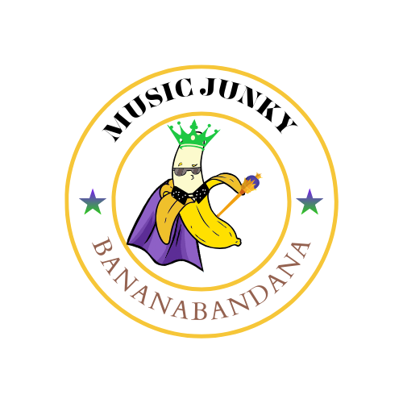

<!-- I create this README.md by using a free template to get a head start of how our READ.me can look professionally -->
<!-- Please let me know your feedback -->
 

 <!-- I wrote down the user story and acceptance criteria of our project name Music Junky -->
## The Criteria of Project 1 
<!-- I hope I spelled our Project name correctly, otherwise please let me know! -->
Welcome to our Project 1 assignment created by Team Bananabandana


* The goal of this assignment was to create a website that is easier for users to search up their favorite artists and compare which applications has more of their favorite artist in a timely manner.


## Project Requirements
You and your group will use everything you’ve learned over the past six modules to create a real-world front-end application that you’ll be able to showcase to potential employers. The user story and acceptance criteria will depend on the project that you create, but your project must fulfill the following requirements:
* Use a CSS framework other than Bootstrap.
* Be deployed to GitHub Pages.
* Be interactive (i.e., accept and respond to user input).
* Use at least two server-side APIs.
* Does not use alerts, confirms, or prompts (use modals).
* Use client-side storage to store persistent data.
* Be responsive.
* Have a polished UI.
* Have a clean repository that meets quality coding standards (file structure, naming conventions, follows best practices for class/id naming conventions, indentation, quality comments, etc.).
* Have a quality README (with unique name, description, technologies used, screenshot, and link to deployed application).

## User Story

```
AS AN music fan, I would like to use an application, where I can compare the data between Spotify and Deezer. 
So, I can identify which of my favorite music artists have more songs in their playlists.

I WANT to use a search engine of my favorite artists and view the statistics between the two applications.

SO THAT I can find which artists have my preferred playlist of my desired choice. 

```

## Acceptance Criteria
```
GIVEN I need a website to research which music artist has more exclusive songs between Spotify and Deezer.

WHEN I can type in a music artist in the search bar and the data is shown in two columns.

THEN the website can generate which playlist has more of my favorite songs in comparison between Spotify and Deezer. 

```


<!-- I added a Project Shields where we can label our License for visual reference.  "Project Shield is a free service that helps protect websites from distributed denial of service (DDoS) attacks. A DDoS attack is an attempt to make our website unavailable by overwhelming it with traffic from multiple sources." -->

<!-- License Project Shield Badge -->
<!-- You can click on the badge that'll directly link to MIT license URL -->

[![MIT License][license-shield]][license-url]
 

<!-- PROJECT LOGO -->
<br />
<div align="center"> 
<!-- Will insert deployed application here once its finished-->
  <a href="https:///Users/kathylopez/Desktop/bootcamp/FirstProject/index.html">
    
  </a>

  <h3 align="center">Welcome-to-Music-Junky</h3>

  <p align="middle">
  A FREE website to search up your favorite artists!
    <br />
    <!-- will change to our website once its deployed-->
    <a href="https:///Users/kathylopez/Desktop/bootcamp/FirstProject/index.html"><strong>Explore the website »</strong></a>
    <br />
    <br />
    <!--I wrote this to help understand what are website is about and roleplay as if our website is live for users to report to our website-->
    <a href="https://github.com/ihateudvrk/FirstProject">View Demo</a>
    ·
    <a href="https://github.com/ihateudvrk/FirstProject">Report Bug</a>
    ·
    <a href="https://github.com/ihateudvrk/FirstProject">Request Feature</a>
  </p>
</div>

<!-- ABOUT THE PROJECT -->
## About Music Junky 

Music Junky is a application to search a favorite artist and compare data on which playlist or album playing on your preferred streaming service.


<!-- TABLE OF CONTENTS of our READ.me -->
<details>
  <summary>Table of Contents</summary>
  <ol>
    <li>
      <a href="#about-music-junky">About Music Junky </a>
      <ul>
        <li><a href="#framework-used">Framework used</a></li>
      </ul>
    </li>
    <li>
      <a href="#getting-started">Getting Started</a>
      <ul>
        <li><a href="#prerequisites">Prerequisites</a></li>
        <li><a href="#installation">Installation</a></li>
      </ul>
    </li>
    <li><a href="#usage">Usage</a></li>
    <li><a href="#roadmap">Roadmap</a></li>
    <li><a href="#contributing">Contributing</a></li>
    <li><a href="#license">License</a></li>
    <li><a href="#contact">Contact</a></li>
    <li><a href="#acknowledgments">Acknowledgments</a></li>
  </ol>
</details>


<!-- Framework on our Project shield-->
### Framework Used

This is includes the framework use to create our application

* [![Bulma][Bulma.io]][bulma-url]


<!-- Instructions on how to tell our users how to install our app  once its deployed -->

## Getting Started

Follow our steps to install our app locally.

### Prerequisites

How to install our software
* npm
  ```sh
  npm install npm@latest -g
  ```

### Installation


Install our app 

1. Get a free API Key at [Musicjunky.com](https://github.com/ihateudvrk/FirstProject)
2. Clone the repo
   ```sh
   git clone git@github.com:ihateudvrk/FirstProject.git
   ```
3. Install NPM packages
   ```sh
   npm install
   ```
   <!-- Enter our API once its finished >
4. Enter your API in `config.js`
   ```js
   const API_KEY = 'ENTER YOUR API';
   ```

<!-- The Links to our Project 1 -->

## Links
 [The URL of the deployed application](Insert link to deployed application HERE )

 [The URL of the Github repository](https://github.com/ihateudvrk/FirstProject)

<!--Our mockup of our assignments -->
## Mock-up
 mockup of our assignment here 


<!-- USAGE EXAMPLES -->

<!-- Not sure if we can include this as part of our READ.ME when we're done with the website -->

## Usage


Use this space to show useful examples of how a project can be used. Additional screenshots, code examples and demos work well in this space. You may also link to more resources.

_For more examples, please refer to the [Documentation](https://example.com)_


<!-- ROADMAP to view our issues on making this project -->
## Roadmap
* [open issues](https://github.com/ihateudvrk/FirstProject/issues) for a full list of proposed features (and known issues).


<!-- CONTRIBUTING -->
## Contributing

Any contributions to our app is strongly recommended. 

Follow the next steps how give us any feedback how to make advanced improvements on our app!

1. Fork the Project
2. Create your Feature Branch (`git checkout -b feature/AmazingFeature`)
3. Commit your Changes (`git commit -m 'Add some AmazingFeature'`)
4. Push to the Branch (`git push origin feature/AmazingFeature`)
5. Open a Pull Request


<!-- LICENSE -->
## License
MIT License 


<!-- CONTACT information  -->
## Contact us 

Team Bananabandana
<!-- I suggest we put our emails for contacts-->
<!-- It can also be other form of social media if you would like -->

* Kathy Lopez- kathyylopezz97@gmail.com
* Darius Beach- dariusbeach4@gmail.com
* Joseph Colon-type  your email here
* Gabe Barraza- type your email here 


<!-- ACKNOWLEDGMENTs -->
<!--I wrote this tab to write down the links and resources from and give credits to-->
## Acknowledgments

The list of our resource list used to create Music Junky 
* [Project Shields](https://shields.io/)


<!-- MARKDOWN LINKS & IMAGES -->
<!-- I used IMG shield website and anchor links to create a badge for visual representation of Bulma framework  and it includes a link to their website-->
<!-- look at line 111 for reference -->
[Bulma.io]:https://img.shields.io/badge/bulma-00D0B1?style=for-the-badge&logo=bulma&logoColor=white
[bulma-url]:https://bulma.io/
[license-shield]:https://img.shields.io/badge/license-MIT-blue
[license-url]:https://github.com/ihateudvrk/FirstProject/blob/main/LICENSE
